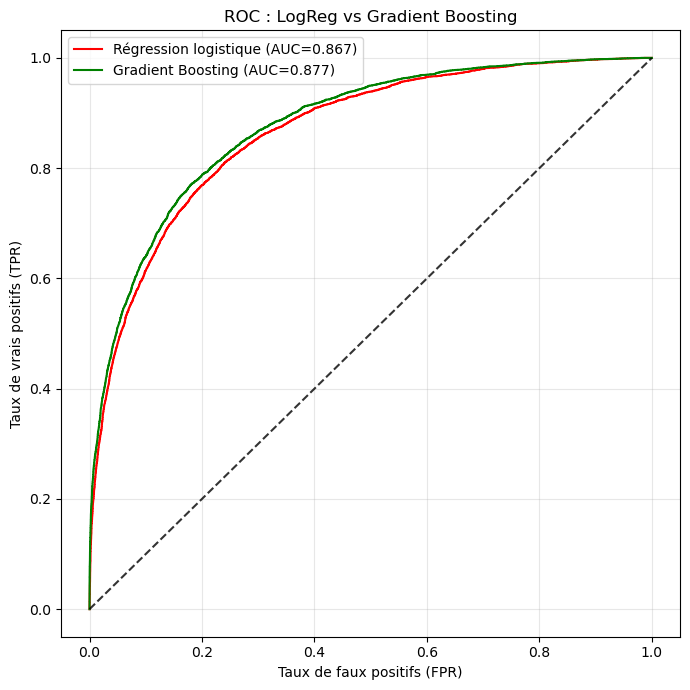
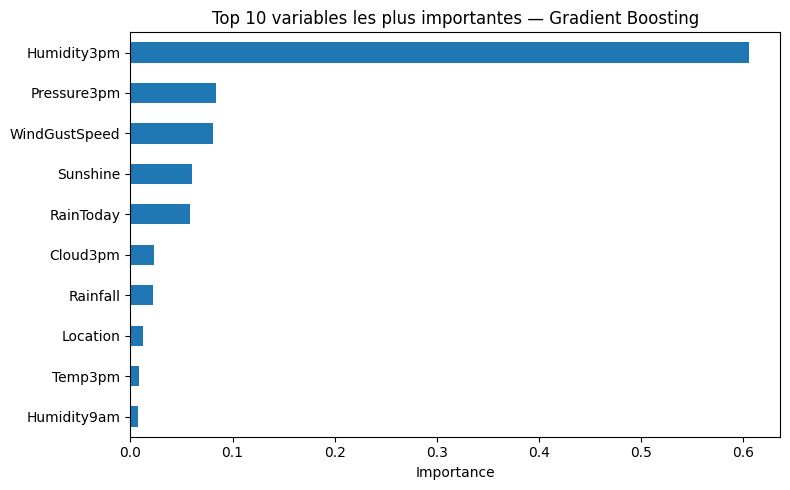

# Prédiction de la pluie en Australie

*Binary classification (scikit-learn) predicting next-day rain from Australian weather station data — logistic regression vs gradient boosting. English summary below.*

Projet réalisé en groupe.

## Problématique

Prédire s'il pleuvra le lendemain (`RainTomorrow`) à partir des relevés
météorologiques du jour, sur la base du jeu de données public
[Rain in Australia](https://www.kaggle.com/datasets/jsphyg/weather-dataset-rattle-package)
(observations quotidiennes de stations météo australiennes).

## Démarche

Analyse exploratoire (distributions, corrélations, boxplots par variable,
pluviométrie par localisation) → prétraitement (encodage, imputation des
valeurs manquantes, standardisation) → séparation train/test (80/20,
stratifiée) → deux modèles de classification comparés :

- **Régression logistique** (pénalisation L2)
- **Gradient Boosting** (`GradientBoostingClassifier`)

## Résultats

| Modèle | Accuracy | ROC-AUC |
|---|---|---|
| Régression logistique | 84,5 % | 0,867 |
| Gradient Boosting | 85,1 % | 0,877 |



Le Gradient Boosting fait légèrement mieux, mais l'écart reste faible. Les
deux modèles détectent très bien les jours sans pluie (rappel ~95 %) mais
peinent davantage sur les jours de pluie (rappel ~50 %), reflet du
déséquilibre des classes dans les données. L'humidité à 15h
(`Humidity3pm`) domine très largement l'importance des variables :



## Stack technique

Python — `pandas`, `numpy`, `matplotlib`, `seaborn`, `scikit-learn`
(`LogisticRegression`, `GradientBoostingClassifier`, `train_test_split`,
`StandardScaler`, `roc_auc_score`, `confusion_matrix`).

## Structure du dépôt

```
├── notebooks/
│   └── rain_prediction_australia.ipynb   # code, résultats et commentaires
└── data/
    └── weatherAUS.csv
```

---

## English summary

Group project predicting next-day
rain in Australia from the public "Rain in Australia" Kaggle dataset.
After EDA and preprocessing (encoding, imputation, scaling), a logistic
regression and a gradient boosting classifier are trained on an 80/20
stratified split and compared. Gradient boosting edges out logistic
regression (85.1% vs 84.5% accuracy, ROC-AUC 0.877 vs 0.867); both models
handle the majority "no rain" class well (~95% recall) but struggle more
on rainy days (~50% recall) due to class imbalance. Afternoon humidity
(`Humidity3pm`) is by far the most important predictor.
